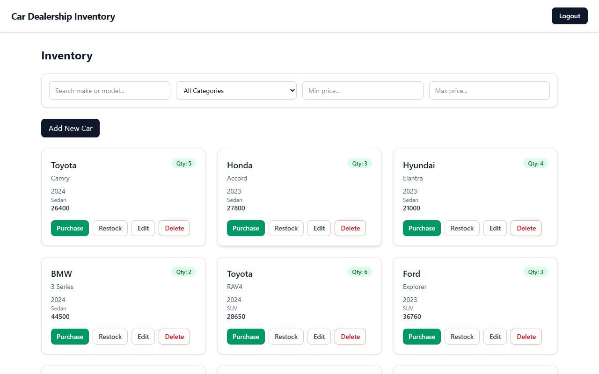
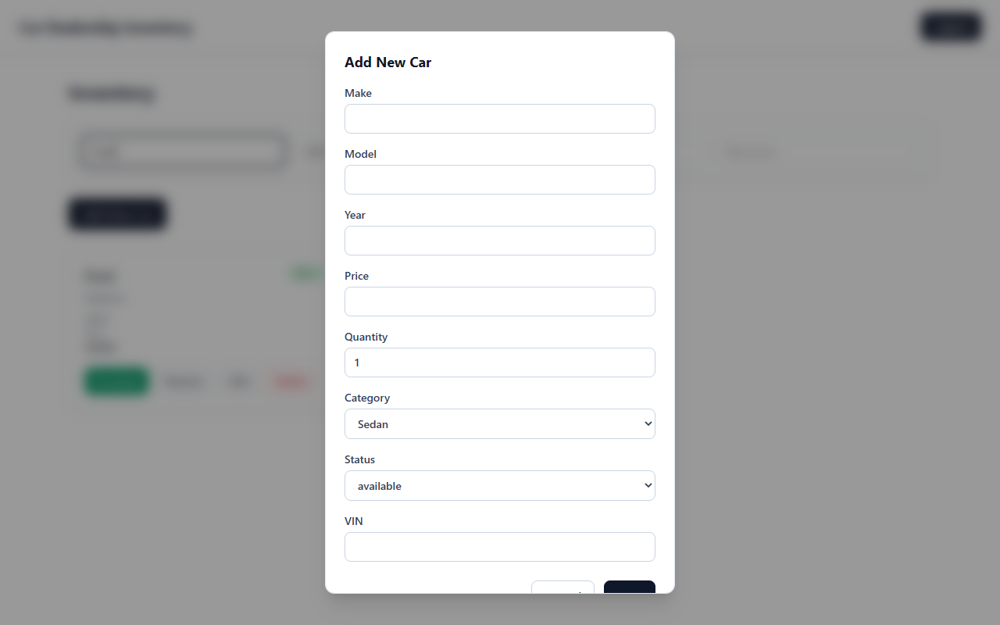

# 🏎️ Car Dealership Inventory System

A production-grade, full-stack MERN application built using strict **Test-Driven Development (TDD)** and **Extreme Programming (XP)** principles. This system provides a robust API and a responsive SPA for managing car inventory, handling role-based stock purchasing, and executing complex vehicle searches.


---

## ✨ Key Features & XP Practices

### 🚀 Core Functionality
- **Inventory Management**: Full CRUD operations for vehicles (Admin only).
- **Stock Control**: `Purchase` logic with atomic database decrementing. `Restock` controls for admins.
- **Advanced Search & Filtering**: Multi-parameter querying by make, model, category, and price range.
- **Role-Based Access Control (RBAC)**: JWT-based authentication distinguishing standard users and admins.

### 🛠️ Engineering Highlights
- **Red-Green-Refactor TDD**: The entire application (both API and UI) was driven by failing test assertions prior to implementation.
- **Race Condition Prevention**: Purchasing endpoints utilize MongoDB's atomic `$inc` operators rather than unsafe read-modify-write patterns.
- **Performance Optimized**: Mongoose schemas implement strict validations, string normalization, and strategic indexing on searchable fields.
- **AI Pair Programming**: Developed in tandem with an AI Assistant (Gemini) acting as an XP pairing partner.

---

## 🌐 Demo & Credentials

- **Frontend Application**: [Live Demo on Netlify](https://car-dealership-inventory.netlify.app)
- **Backend API Base**: [Render API URL](https://car-dealership-inventory-system-evdm.onrender.com/api)

### 🔑 Demo Credentials (Pre-seeded in DB)
| Role | Email | Password | Capabilities |
| :--- | :--- | :--- | :--- |
| **Admin** | `admin@dealership.com` | `Password123!` | Add/Edit/Delete Vehicles, Restock, Search |
| **User** | `user@dealership.com` | `Password123!` | Search, Filter, Purchase Vehicles |

---

## 🖼️ Application Screenshots

<details open>
<summary><b>Click to toggle screenshots</b></summary>
<br>

### Dashboard & Inventory Management


### Search & Filtering in Action


</details>

---

## 🏗️ Tech Stack & System Architecture

- **Frontend**: React 19, React Router v7, Tailwind CSS v4, Vite. 
- **Backend**: Node.js, Express.js 5.2, JWT (`jsonwebtoken`), `bcryptjs`.
- **Database**: MongoDB Atlas with Mongoose ODM.
- **Testing**:
  - **Backend**: Jest, Supertest (In-memory mock DB isolation).
  - **Frontend**: Vitest, React Testing Library.

---

## ⚙️ Local Setup & Environment Variables

### 1. Installation
Clone the repository and install all dependencies:
```bash
npm run install:all
```

### 2. Environment Configuration
Create `.env` files in both the `frontend` and `backend` directories.

<details>
<summary><b>Sample `backend/.env`</b></summary>

```env
PORT=5000
MONGO_URI=mongodb://127.0.0.1:27017/car_inventory_db
JWT_SECRET=super_secret_jwt_key_123
```
</details>

<details>
<summary><b>Sample `frontend/.env`</b></summary>

```env
VITE_API_URL=http://localhost:5000/api
```
</details>

### 3. Database Seeding (Optional)
To populate the database with 15 initial vehicles and demo users (including the credentials listed above):
```bash
cd backend
npm run seed
```

### 4. Running the Development Servers
Start both servers concurrently using the workspace terminals:
```bash
# Terminal 1: Backend
cd backend
npm run dev

# Terminal 2: Frontend
cd frontend
npm run dev
```

---

## 🧪 Testing & TDD Workflow

This project adheres strictly to **Test-Driven Development (TDD)**. All core logic was tested via integration/unit tests *before* writing the implementation (evidenced by the RED/GREEN commit history).

### Running Tests
```bash
# Run Backend API test suite (Jest + Supertest)
cd backend
npm test

# Run Frontend component test suite (Vitest + RTL)
cd frontend
npm test
```

---

## 🤖 My AI Usage

### AI Assistant & Pair Programming Workflow
During the development of this project, **Antigravity (Gemini)** was utilized as an AI pair programmer following strict Test-Driven Development (TDD) guardrails.

- **TDD Enforcement (Red-Green-Refactor)**: The AI assistant was tasked with first writing failing integration and component tests (**RED phase**), running the test runner to empirically verify failure, and committing the tests before writing any production code.
- **Engineering Rigor**: Guided the implementation of atomic `$inc` database queries, index optimizations, JWT state synchronization, and schema normalizations.
- **Co-Authorship Methodology**: All automated git commits created during AI-assisted phases include explicit co-authorship trailers: `Co-authored-by: Gemini <Gemini@users.noreply.github.com>`.

See [PROMPTS.md](./PROMPTS.md) for the complete AI interaction log.